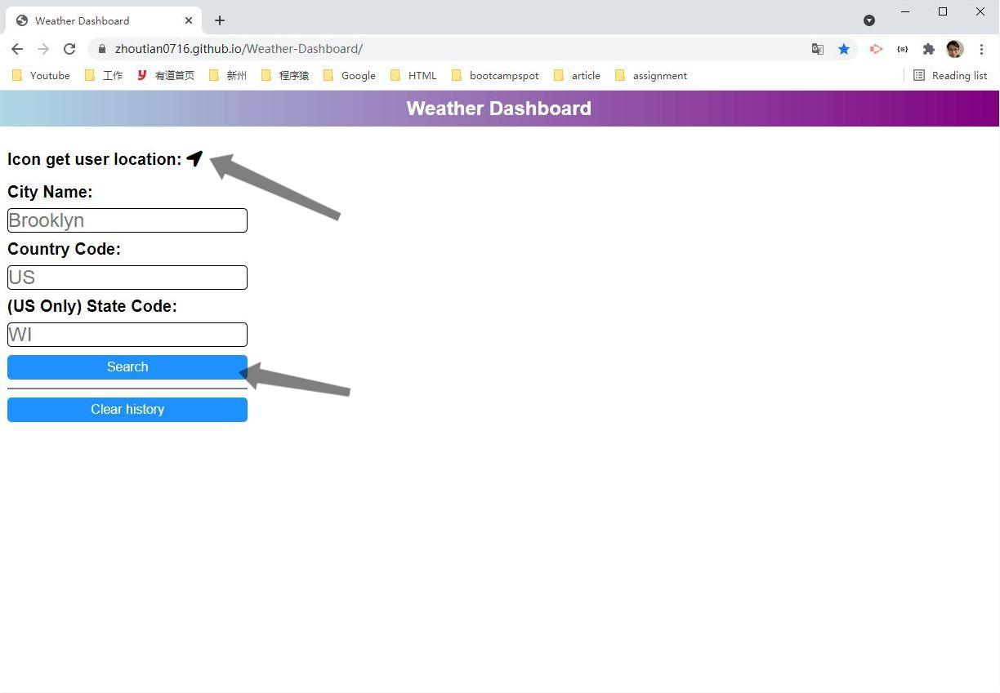
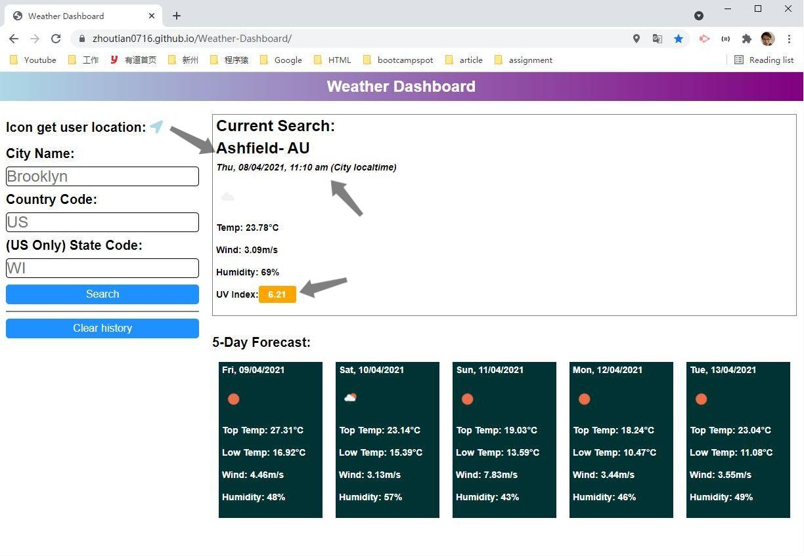
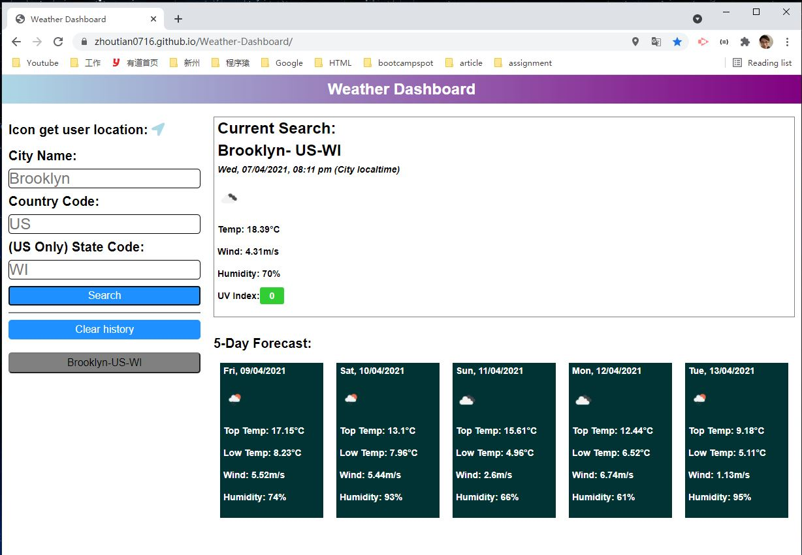
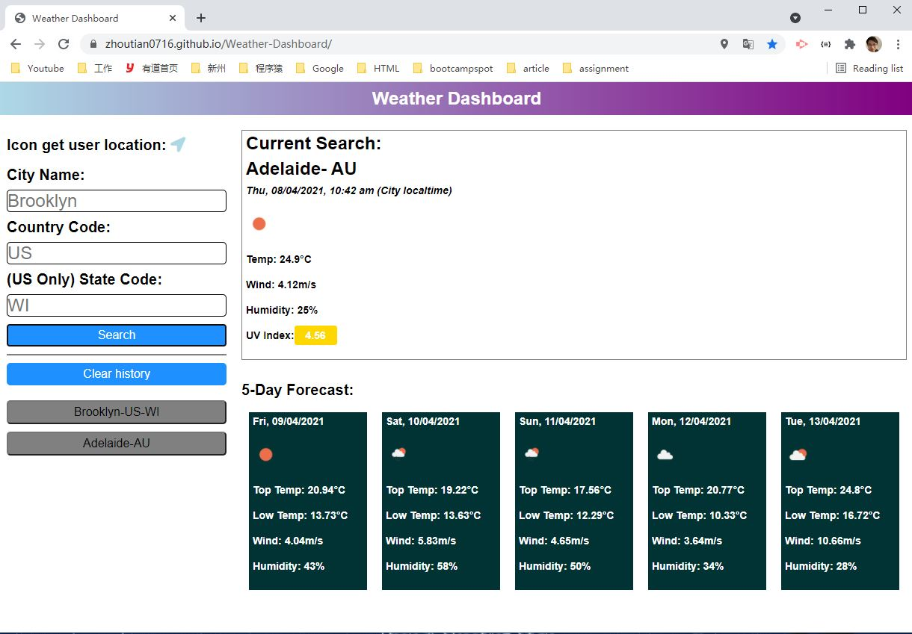
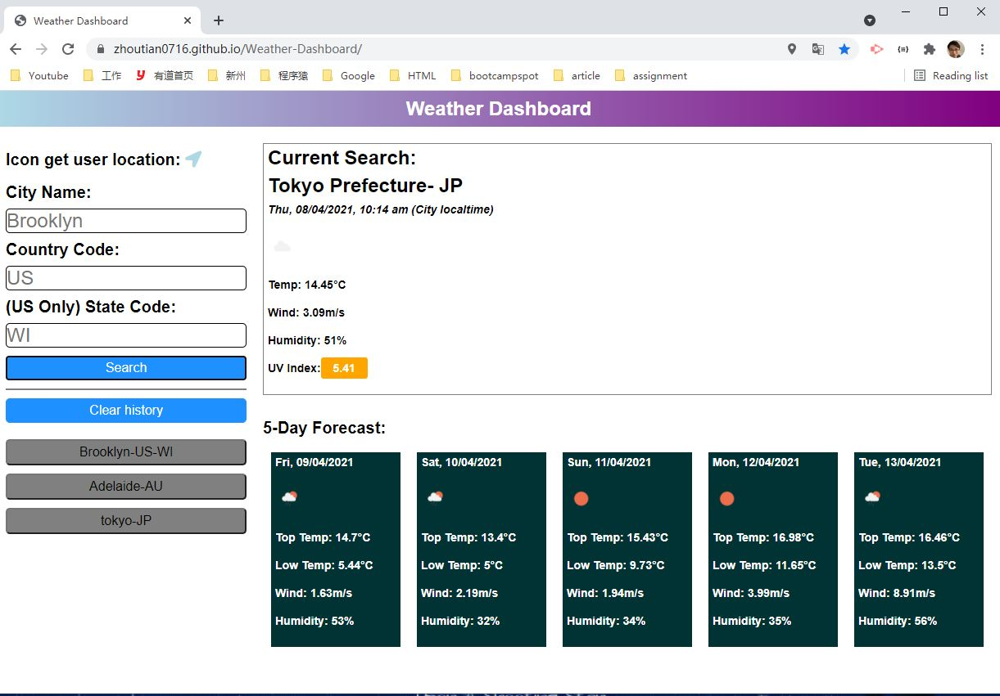
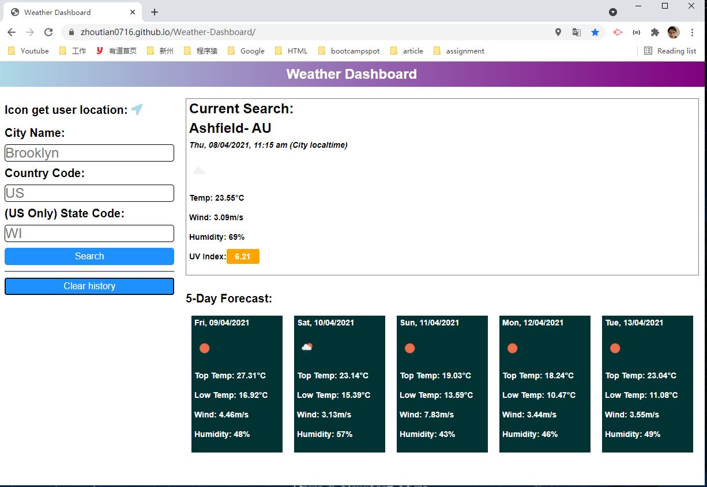
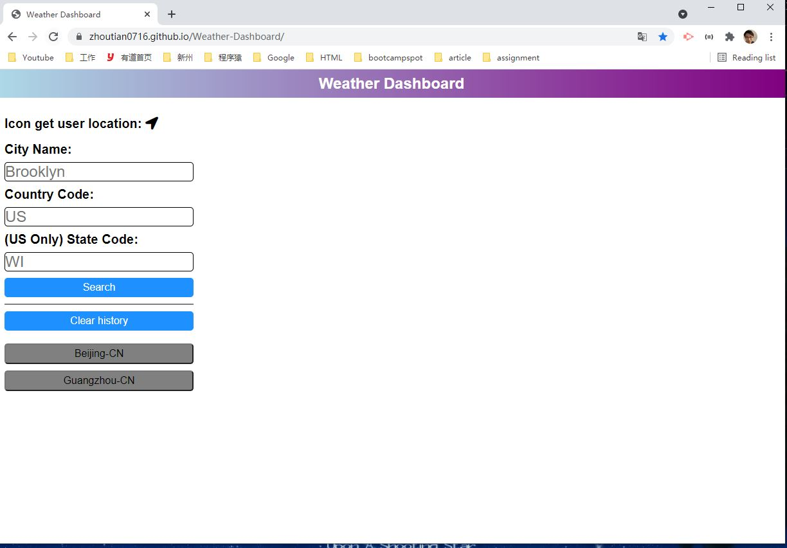
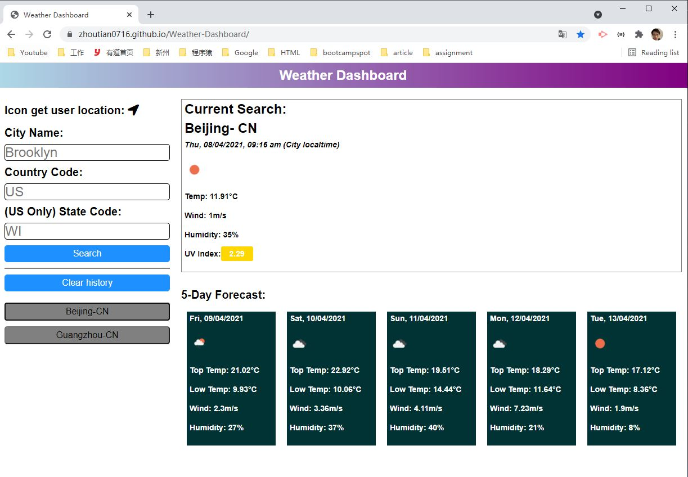

# Weather-Dashboard
* The URL of the deployed application

    https://zhoutian0716.github.io/Weather-Dashboard/
* The URL of the GitHub repository, with a unique name and a README describing the project
    
    https://github.com/ZhouTian0716/Weather-Dashboard

# User Story
AS A traveler
I WANT to see the weather outlook for multiple cities
SO THAT I can plan a trip accordingly.
# Acceptance Criteria

```
GIVEN a weather dashboard with form inputs
WHEN I search for a city
THEN I am presented with current and future conditions for that city and that city is added to the search history
WHEN I view current weather conditions for that city
THEN I am presented with the city name, the date, an icon representation of weather conditions, the temperature, the humidity, the wind speed, and the UV index
WHEN I view the UV index
THEN I am presented with a color that indicates whether the conditions are favorable, moderate, or severe
WHEN I view future weather conditions for that city
THEN I am presented with a 5-day forecast that displays the date, an icon representation of weather conditions, the temperature, the wind speed, and the humidity
WHEN I click on a city in the search history
THEN I am again presented with current and future conditions for that city
```
# Demonstration Snapshoots
The following image shows the web application's appearance and functionality:

1.Page first load as the following, start from the arrows.


2.Click navigation icon to display user local weather.(Note: The current time displayed was the UTC from the searched City.)


3.Search an US City and the search history was successfully saved as a button.


4.Try to pick a few more cities all over the world, see if it works fine.(Note: Please type in valid city names in English and follow valid Country Codes, this app is not foolproof ready.)



5.When user click the clear history button, previous searches all removed, user current located city's weather shown.


6.When user refresh the page, weather display section was hidden, previous searches persist in the grey buttons.


7.Previous search successfully accessed.


# Server side APIs


* One Call API: https://api.openweathermap.org/data/2.5/onecall?lat={lat}&lon={lon}&exclude={part}&appid={API key}

* Direct geocoding: http://api.openweathermap.org/geo/1.0/direct?q={city name},{state code},{country code}&limit={limit}&appid={API key}

* Reverse geocoding: http://api.openweathermap.org/geo/1.0/reverse?lat={lat}&lon={lon}&limit={limit}&appid={API key}

# Third Parts Scripts

* Jquery
* Jquery UI Widget
* Fontawesome
* Moment.js

# Written by 
Zhou Tian